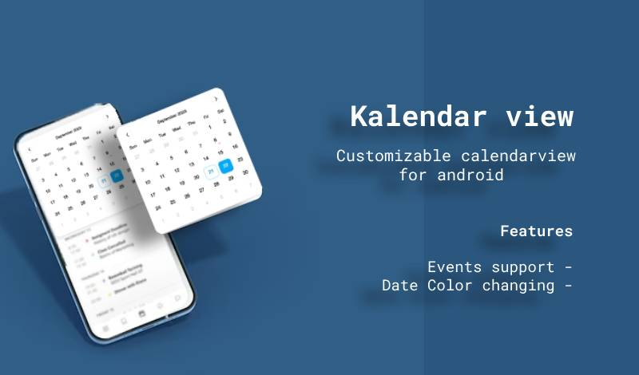

# KalendarView
Customisable calendar view for android

Customize many things as much you need



## Features
- Adding events supported
- Set specific colors for any dates
- Customizable indicators (today date, selected date, event)
- Customizable text colors (today date, selected date, showing month date color, non-showing month date color)
- Customizable font family (seperately for month name, week names, dates)
- Customizable textAppearances (seperately for month name, week names, dates)
- Customizable next and prev icons
- Customizable background color

## Usage
### Gradle

- **Step 1**

#### In older Gradle Style (Build.gradle (project level))
```
allprojects {
  repositories {
    ...
    maven { url 'https://jitpack.io' }
  }
}
```

#### In New Project Structure (Settings.gradle)
```
dependencyResolutionManagement {
    repositoriesMode.set(RepositoriesMode.FAIL_ON_PROJECT_REPOS)
    repositories {
        ......
        maven { url 'https://jitpack.io' }
        .....
    }
}
```
<br>
<br>

- **Step 2**

#### In app level Build.gradle
```
dependancies {
  ...
  implementation 'com.github.afsalkodasseri:KalendarView:2.2'
}
```
<br>
<br>

### Xml
```
<com.ak.KalendarView
    android:id="@+id/kalendar"
    android:layout_width="wrap_content"
    android:layout_height="wrap_content"
    android:layout_marginTop="10dp"
    android:layout_marginHorizontal="10dp"
    app:calendarBackground="#FFFFFF"
    app:dateTextStyle="@style/weekText"
    app:monthTextStyle="@style/weekText"
    app:nextIcon="@drawable/calendarview_front"
    app:prevIcon="@drawable/calendarview_back"
    app:selectedIndicator="@drawable/custom_select_date"
    app:todayDateColor="#027DB5"
    app:todayIndicator="@drawable/custom_today"
    app:weekTextStyle="@style/weekText" />
```

<br>
<br>

### Java

- For Setting Text Colors for some dates

```
<!---Initialize object for the kalendarView--->
KalendarView mKalendarView = findViewById(R.id.kalendar);


<!---Adding Colors for some specific date--->
List<ColoredDate> datesColors = new ArrayList<>();

datesColors.add(new ColoredDate(new Date(), getResources().getColor(R.color.red_holiday)));    
<!---Where ColoredDate(Date mDate,int color)--->

<!---set the color dates list--->
mKalendarView.setColoredDates(datesColors);
```
<br>

- For Adding events on some dates

```
<!---Adding events list--->
List<EventObjects> events = new ArrayList<>();

events.add(new EventObjects("meeting",new Date()));
<!---Where EventObjects(String message, Date date)--->

<!---set the events list--->
mKalendarView.setEvents(events);
```

<br>
<br>

### Xml Attributs

| Attribute  | Description |  Values accepts in xml  |
| ------------- | ------------- | ------------------ |
| todayIndicator | Indicator to show the today's date  |      Drawable   |
| selectedIndicator  | Indicator to show the selected date  |     Drawable    |
| eventIndicator | To indicate the events in the date cell | Drawable |
| dateColor | Color to change the date text color of showing month | Color |
| nonMonthDateColor | Color to change the date text color of non-showing month(previous and next month's) | Color |
| todayDateColor | Color to change the date text color of today's date | Color |
| selectedDateColor | Color to change the date text color of selected date | Color| 
| monthFontFamily | Font Family of month, year head in the top | Font family |
| weekFontFamily |Font Family of week days head | Font family |
| dateFontFamily | Font Family of date text | Font family |
| monthTextStyle | TextAppearance of month,year head | Text style |
| weekTextStyle | TextAppearance of weekdays head | Text style |
| dateTextStyle | TextAppearance of date text | Text style |
| nextIcon | Drawable for next icon | Drawable |
| prevIcon | Drawable for prev icon | Drawable |
| calendarBackground | color for calendar background | Color |

<br>
<br>

## Thanks & Support
If you've found an error while using the library, please let me know
<br>


**Thank you :heart:**

<br>
<br>

